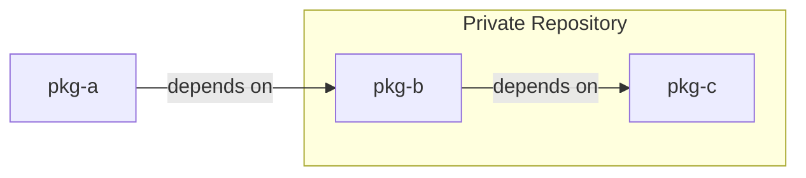

# Poetry Bug Reconstruction

`poetry install` fails when a direct dependency from a private repository
has a transitive dependency from the same private repository and source priority
is set to explicit.

There is a bug in [poetry](https://github.com/python-poetry/poetry) that causes
it to fail during `poetry install` when:
 - there are dependencies from a private repository
 - the private repository source is defined with `priority="explicit"`
 - one of the direct dependencies has a transitive dependency from the same private repository

This repository is a minimal reproduction of the bug using
[devpi](https://devpi.net/docs/devpi/devpi/latest/+doc/index.html#)
to host the private repository locally.
Three packages are defined in this repository that depend on each other in the following way:


The reconstruction consists in creating `devpi` server, publishing the packages to it
and then trying to install `pkg-a` with `poetry install`.
To reproduce the bug run the following commands:

```bash
# Install devpi-server
poetry install

# Start devpi server (will run on localhost:3141 — make sure this port is either free or change it in the script)
poetry run ./01-start-devpi-server.sh

# Publish packages to devpi
poetry run ./02-publish-pkgs.sh

# Install pkg-a
cd pkg-a
poetry install # This will fail with following error:
# Because no versions of pkg-b match >0.1,<0.2
#  and pkg-b (0.1.0) depends on pkg-c (>=0.1,<0.2), pkg-b (>=0.1,<0.2) requires pkg-c (>=0.1,<0.2).
# So, because no versions of pkg-c match >=0.1,<0.2
#  and pkg-a depends on pkg-b (^0.1), version solving failed.

# clean-up: kill devpi server
kill $(cat supervisord.pid)
```

If the priority of the devpi repository in `pkg-a` is changed from `priority="explicit"`
to `priority="supplemental"` in `pyproject.toml` then the installation will succeed.
